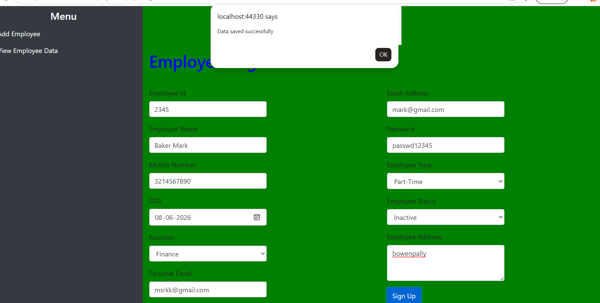
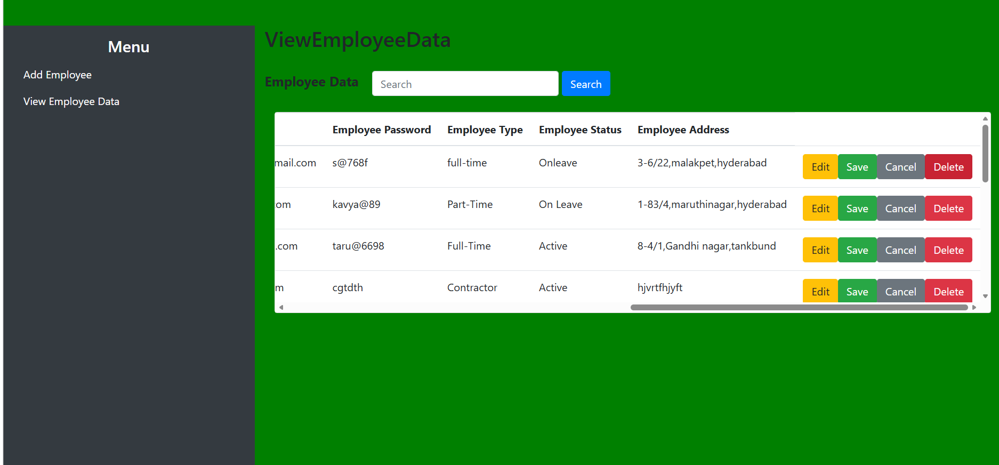
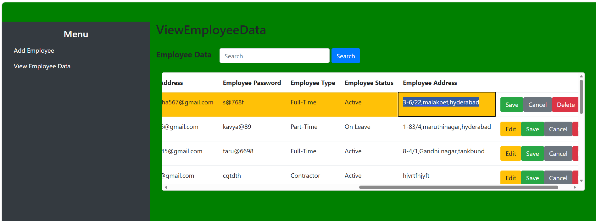
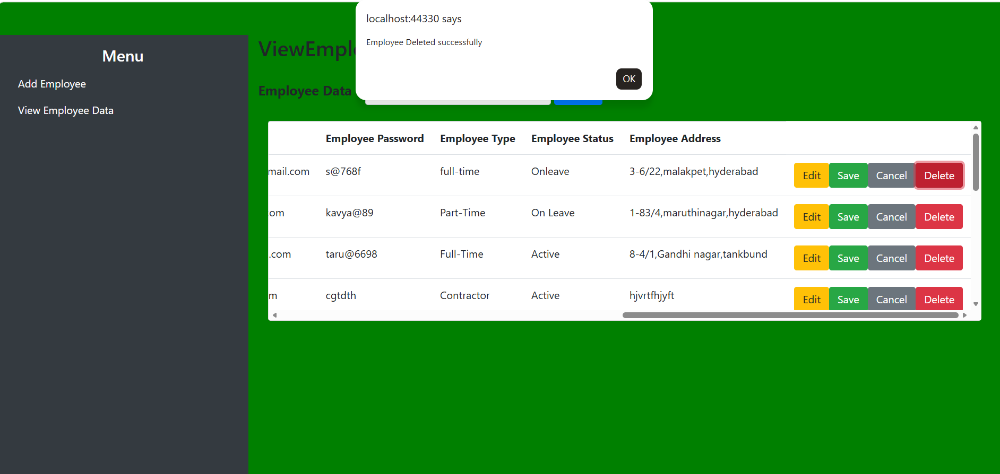
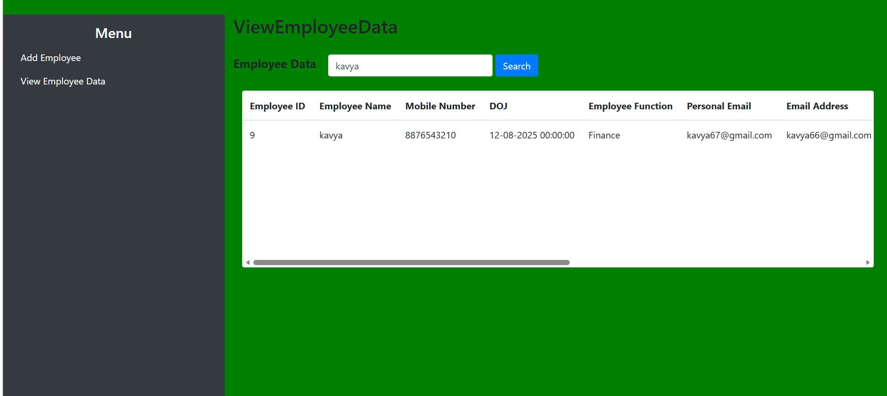

# Employee Management System

## Project Overview

Employee Management System is a web application developed using ASP.NET MVC, C#, ADO.NET, SQL Server, HTML, CSS, JavaScript, jQuery, and Bootstrap.

The application allows users to:

- Add Employee Details
- View Employee Records
- Search Employees
- Edit Employee Information
- Update Employee Records
- Delete Employee Records

The project follows the MVC (Model-View-Controller) architecture and uses SQL Server Stored Procedures for database operations.

---

## Technologies Used

### Frontend
- HTML5
- CSS3
- Bootstrap
- JavaScript
- jQuery

### Backend
- ASP.NET MVC
- C#

### Database
- SQL Server
- ADO.NET
- Stored Procedures

---

## Features

### Employee Registration
- Add new employee details
- Employee Name
- Mobile Number
- Date of Joining
- Employee Function
- Personal Email
- Official Email
- Password
- Employee Type
- Employee Status
- Address

### Employee Data Management
- View all employee records
- Search employees by name
- Edit employee information
- Save updated employee details
- Delete employee records

---

## Project Architecture

MVC Architecture:

```
Model      -> Employee.cs
View       -> EmployeeRegistration.cshtml
              ViewEmployeeData.cshtml
Controller -> EmployeeController.cs
Database   -> SQL Server Stored Procedures
```

---

## Stored Procedures Used

### Insert Employee

```sql
spInsertEmployee
```

### Get Employee Data

```sql
spGetEmployeeData
```

### Search Employee

```sql
spSearchResults
```

### Update Employee

```sql
spUpdateEmployeeDetails
```

### Delete Employee

```sql
spDeleteEmployee
```

---

## Folder Structure

```text
MVCproject
│
├── Controllers
│   └── EmployeeController.cs
│
├── Models
│   └── Employee.cs
│
├── Views
│   └── Employee
│       ├── EmployeeRegistration.cshtml
│       └── ViewEmployeeData.cshtml
│
├── Scripts
│   └── jquery-3.4.1.js
│
├── Images
│   ├── logo.jpg
│   └── Employee.jpg
│
└── Web.config
```

---

## Screenshots

### 1. Employee Registration Page



---

### 2. View Employee Data



---

### 3. Edit Employee Record



---

### 4. Delete Employee Record



---

### 5. Search Employee



---

## Database Table Structure

```sql
Employee
(
    empid INT PRIMARY KEY IDENTITY(1,1),
    empname VARCHAR(100),
    mobilenumber BIGINT,
    doj DATETIME,
    empfunction VARCHAR(100),
    personalemail VARCHAR(100),
    emailaddress VARCHAR(100),
    emppassword VARCHAR(100),
    emptype VARCHAR(50),
    empstatus VARCHAR(50),
    empaddress VARCHAR(500)
)
```

---

## How to Run the Project

### Step 1

Clone Repository

```bash
git clone <repository-url>
```

### Step 2

Open Project in Visual Studio

### Step 3

Create SQL Server Database

```sql
CREATE DATABASE EmployeeDB
```

### Step 4

Create Employee Table

Run Employee table script.

### Step 5

Create Stored Procedures

- spInsertEmployee
- spGetEmployeeData
- spSearchResults
- spUpdateEmployeeDetails
- spDeleteEmployee

### Step 6

Update Connection String

```xml
<connectionStrings>
  <add name="DBConnectionString"
       connectionString="Data Source=SERVERNAME;
       Initial Catalog=EmployeeDB;
       Integrated Security=True" />
</connectionStrings>
```

### Step 7

Run the Application

Press:

```text
F5
```

or

```text
Ctrl + F5
```

---

## Key Concepts Implemented

- ASP.NET MVC Architecture
- ADO.NET
- SQL Server Stored Procedures
- CRUD Operations
- AJAX Calls
- jQuery DOM Manipulation
- Bootstrap UI
- Search Functionality
- Client Side Operations
- Server Side Processing

---

## Future Enhancements

- Login Authentication
- Role Based Access
- Pagination
- Email Notifications
- Export to Excel
- Dashboard Reports
- Entity Framework Integration

---

## Author

Shashrutha

ASP.NET MVC | C# | SQL Server Developer